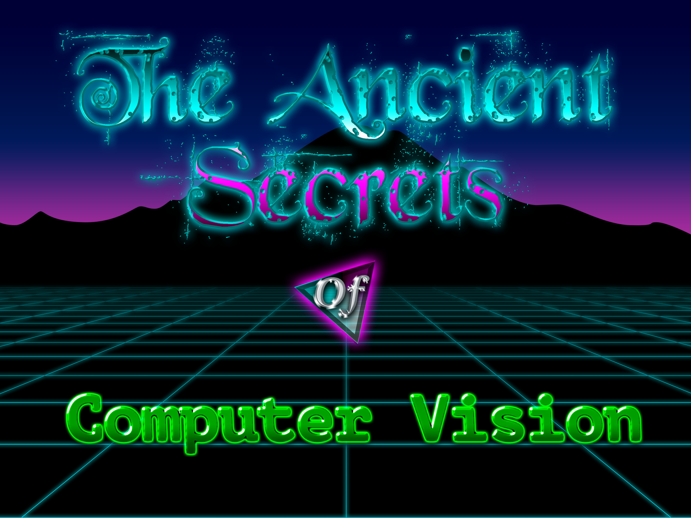

## Course Information ##

This class is a general introduction to computer vision. It covers standard techniques in image processing like filtering, edge detection, stereo, flow, etc. (old-school vision), as well as newer, machine-learning based computer vision. It was originally offered in the [spring of 2018 at the University of Washington](https://courses.cs.washington.edu/courses/cse455/18sp/).

### Instructors ###
- [Joseph Redmon](https://pjreddie.com)
- [Ali Farhadi](http://homes.cs.washington.edu/~ali/)

### TAs ###
- Connor Schenck
- Kiana Ehsani
- Xin Ru Wang
- Yao Lu

Slides are a mishmash of lots of other people's work. Special thanks to: Rob Fergus, Linda Shapiro, Harvey Rhody, Rick Szeliski, Ali Farhadi, Robert Collins. Lectures 8 and 9 on Flow, 3d, and stereo are given by [Connor Schenck](https://homes.cs.washington.edu/~schenckc/).

All of the slides, videos, and homeworks are free to use, modify, redistribute as you like without permission. Just make your own copy of the slides on Google Docs, don't ask to modify mine!

## Homeworks ##

The class has 6 homeworks where you will build out a computer vision library in C. We cover basic image manipulations, filtering, features, stitching, optical flow, machine learning, and convolutional neural networks.

- [Homework 0: Fun with Color!](https://github.com/pjreddie/vision-hw0)
- [Homework 1: Resizing and Filtering](https://github.com/pjreddie/vision-hw1)
- [Homework 2: Panoramas!](https://github.com/pjreddie/vision-hw2)
- [Homework 3: Optical Flow](https://github.com/pjreddie/vision-hw3)
- [Homework 4: Neural Networks and Machine Learning](https://github.com/pjreddie/vision-hw4)
- [Homework 5: PyTorch](https://github.com/ehsanik/vision-hw5)

## Final Project: ##

There was a final project worth 20% of the final grade.

Pick any area of computer vision that interests you and pursue some independent work in that area. Each project should have a significant technical component, software implementation, or large-scale study. Projects can focus on developing new techniques or tools in computer vision or applying existing tools to a new domain. If you don't have an idea you can train a classifier on birds and compete in the Kaggle competition posted on the Google Group.

## Lectures ##

Lectures were automatically recorded with the schools Pantopto system. Unfortunately, some were recorded at the wrong aspect ratio and the audio was not recorded in the image segmentation lecture.

This [YouTube playlist](https://www.youtube.com/playlist?list=PLjMXczUzEYcHvw5YYSU92WrY8IwhTuq7p) has all of the lectures in sequential order.

#### Lecture 1: Introduction ####

- [Video](https://www.youtube.com/watch?v=8jXIAWg_yHU)
- [Slides](https://docs.google.com/presentation/d/1XUUV4cmqvcwIOHuoXAb-F1CPvxVLRh7c0KNZsqYtT2c/edit?usp=sharing)

#### Lecture 2: Human Vision, Color Spaces, Transforms ####

- [Video](https://www.youtube.com/watch?v=-nt80JUNwlw)
- [Slides](https://docs.google.com/presentation/d/1YBK7QkBW9t4kuZ8bJdwXLspyyeSpEJJldHvAhVcSsiM/edit?usp=sharing)
- Further reading:
    - [CV - 2.3.2 Color](http://szeliski.org/Book/drafts/SzeliskiBook_20100903_draft.pdf#page=102)
    - [CVAMA - 3 Color](http://cmuems.com/excap/readings/forsyth-ponce-computer-vision-a-modern-approach.pdf#page=68)
    - [A painter discussing color vision](http://handprint.com/LS/CVS/color.html)

#### Lecture 3: Image Coordinates, Resizing

- [Video](https://www.youtube.com/watch?v=hpqrDUuk7HY)
- [Slides](https://docs.google.com/presentation/d/1ZkGgPPUzlGOdoGK6YNgiVLNouJW1ZaWzKEupDKmYM_4/edit?usp=sharing)

#### Lecture 4: Resizing, Filters, Convolutions

- [Video](https://www.youtube.com/watch?v=5xdbJ7z4Nrc)
- [Slides](https://docs.google.com/presentation/d/18f0cWwS40jwbP5u37LKvM9ZaHEtRQFUKQ7MCtMdGLmA/edit?usp=sharing)
- Further reading:
    - [CVAMA - 7 Linear Filters and Convolution](http://cmuems.com/excap/readings/forsyth-ponce-computer-vision-a-modern-approach.pdf#page=197)

#### Lecture 5: Edges and Features

- [Video](https://www.youtube.com/watch?v=z5WSV6CXsxs)
- [Slides](https://docs.google.com/presentation/d/1_ZOtT17Ih2P-MRbWtZ8CTRQaJBz9V6-5_VA00QebiQQ/edit?usp=sharing)

#### Lecture 6: Harris, Matching, RANSAC

- [Video](https://www.youtube.com/watch?v=bn4KHa_zWuQ)
- [Slides](https://docs.google.com/presentation/d/1GLPcw-hQB1D94mOzTZKdMwAa8NKuqgih-bWl1vJS0tE/edit?usp=sharing)

#### Lecture 7: Matching, RANSAC, HOG, and SIFT

- [Video](https://www.youtube.com/watch?v=taty6lPVcmA)
- [Slides](https://docs.google.com/presentation/d/1h2Az_a28qjKvLpbkwXoW0eut9HTwmjTkjCtk876PYN8/edit?usp=sharing)

#### Lecture 8: Optical Flow

- [Video](https://www.youtube.com/watch?v=a-v5_8VGV0A)
- [Slides](https://docs.google.com/presentation/d/1guQ0hGL7tfHibiYID6gULCUO2OJJpNaWu6VYJXScdeY/edit?usp=sharing)

#### Lecture 9: 3D, Depth, and Stereo

- [Video](https://www.youtube.com/watch?v=AA8FEwutsVk)
- [Slides](https://docs.google.com/presentation/d/1ZaFvVx8U7hJpGqaqk4Fxjj5QU-EHt8B8zmYbK6uaEaI/edit?usp=sharing)

#### Lecture 10: Machine Learning for Computer Vision

- [Video](https://www.youtube.com/watch?v=AIL5PuvRAPI)
- [Slides](https://docs.google.com/presentation/d/1QgvrxpjVJLcYPWPVm9gXvqLjQth4um1nJpc0R00SNpg/edit?usp=sharing)

#### Lecture 11: More Machine Learning for Computer Vision

- [Video](https://www.youtube.com/watch?v=3fCrfabOm8U)
- [Slides](https://docs.google.com/presentation/d/1sU-rMMkWXMuQYhjJkhPFAD7VifZnxXMBxOfevdwOOKU/edit?usp=sharing)

#### Lecture 12: Neural Networks

- [Video](https://www.youtube.com/watch?v=fXuIpJ-2MR4)
- [Slides](https://docs.google.com/presentation/d/1NLdRUsxH30tSNe46OOd3rPa-xoKFkDR-fYH8rnh0POo/edit?usp=sharing)

#### Lecture 13: Convolutional Neural Networks

- [Video](https://www.youtube.com/watch?v=RnD0OFbZGbA)
- [Slides](https://docs.google.com/presentation/d/1LwTvykcPzDoAzQyAZB4cbP5Lh_czqfBAMGnBddVHbxs/edit?usp=sharing)

#### Lecture 14: Network Architectures

- [Video](https://www.youtube.com/watch?v=-XK_uMVD2CY)
- [Slides](https://docs.google.com/presentation/d/1B2pEaFkaUIyNDk_XxlH_43fOUNI_OY-L42Q8ZnRrFKY/edit?usp=sharing)

#### Lecture 15: Semantic Segmentation

- Due to the UW grad student strike, Ali gave this lecture. Unfortunately, the audio did not get recorded. I can post the video if you want but it's very boring... If you are sad there isn't another great lecture here, please email UW President Ana Mari Cauce, <pres@uw.edu> and let her know!

#### Lecture 16: Object Detection

- [Video](https://www.youtube.com/watch?v=2irYRgCFC1I)
- [Slides](https://docs.google.com/presentation/d/1O3JfanUU7ey7D4FCtb_eF7w0l8MMmrg4L0vqSjVix_c/edit?usp=sharing)

#### Lecture 17: Guest Lecture from [Ira Kemelmacher-Shlizerman](https://homes.cs.washington.edu/~kemelmi/)

- Ira stopped by class to tell students about some awesome research going on in her lab. Unfortunately, the audio again didn't record. You can check out [this video](https://www.youtube.com/watch?v=yLh_RIVJwwY) of some of the research she covered in class.

#### Lecture 18: Detection and Instance Segmentation

- [Video](https://www.youtube.com/watch?v=s989zzFkaFo)
- [Slides](https://docs.google.com/presentation/d/1Re2IX7nHuh22y7cMj8rcmN_nP5dDcdRz2zw-6eWwjVY/edit?usp=sharing)

#### Lecture 19: Vision and Language

- [Video](https://www.youtube.com/watch?v=EbUqT_TfCTM)
- [Slides](https://docs.google.com/presentation/d/1OWA9GULbXJrZvHgDB-49Wn7KQCwXNw4JaFEGy2EcBxI/edit?usp=sharing)

#### Lecture 20: Generative Adversarial Networks

- [Video](https://www.youtube.com/watch?v=erVD9DMik_Q)
- [Slides](https://docs.google.com/presentation/d/1kMJ8IA_aUFhO-KRkJPO0m8jvNIb6QZNp2CT8J8ITapU/edit?usp=sharing)
