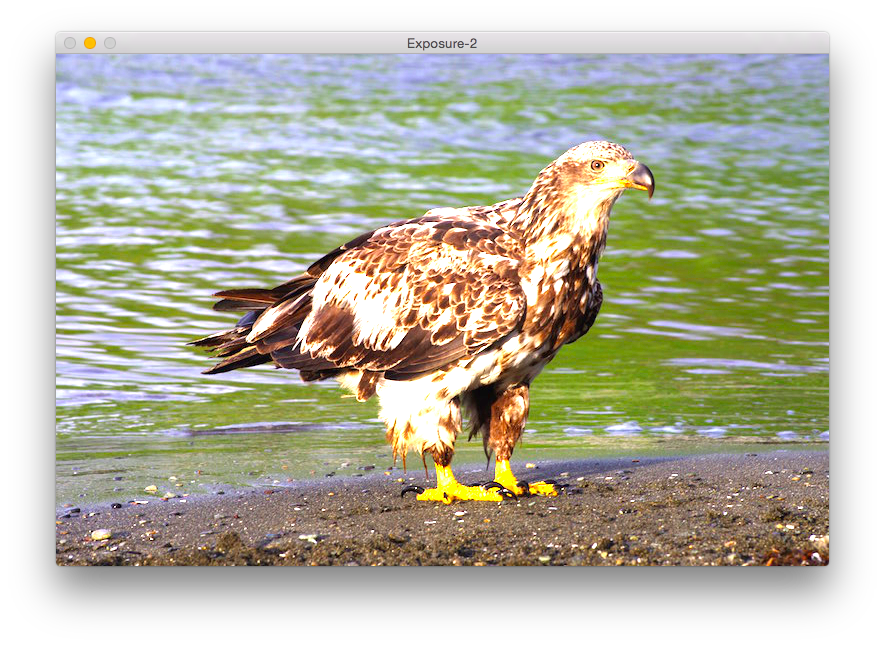

Darknet is easy to install with only two optional dependancies:

- [OpenCV](http://opencv.org/) if you want a wider variety of supported image types.
- [CUDA](https://developer.nvidia.com/cuda-downloads) if you want GPU computation.

Both are optional so lets start by just installing the base system. I've only tested this on Linux and Mac computers. If it doesn't work for you, email me or something?

## Installing The Base System ##
First clone the Darknet git repository [here](https://github.com/pjreddie/darknet). This can be accomplished by:

    git clone https://github.com/pjreddie/darknet.git
    cd darknet
    make

If this works you should see a whole bunch of compiling information fly by:

    mkdir -p obj
    gcc -I/usr/local/cuda/include/  -Wall -Wfatal-errors  -Ofast....
    gcc -I/usr/local/cuda/include/  -Wall -Wfatal-errors  -Ofast....
    gcc -I/usr/local/cuda/include/  -Wall -Wfatal-errors  -Ofast....
    .....
    gcc -I/usr/local/cuda/include/  -Wall -Wfatal-errors  -Ofast -lm....

If you have any errors, try to fix them? If everything seems to have compiled correctly, try running it!

    ./darknet

You should get the output:

    usage: ./darknet <function>

Great! Now check out the cool things you can do with darknet [here](https://pjreddie.com/darknet/).

## Compiling With CUDA ##

Darknet on the CPU is fast but it's like 500 times faster on GPU! You'll have to have an [Nvidia GPU](https://developer.nvidia.com/cuda-gpus) and you'll have to install [CUDA](https://developer.nvidia.com/cuda-downloads). I won't go into CUDA installation in detail because it is terrifying.

Once you have CUDA installed, change the first line of the `Makefile` in the base directory to read:

    GPU=1

Now you can `make` the project and CUDA will be enabled. By default it will run the network on the 0th graphics card in your system (if you installed CUDA correctly you can list your graphics cards using `nvidia-smi`). If you want to change what card Darknet uses you can give it the optional command line flag `-i <index>`, like:

    ./darknet -i 1 imagenet test cfg/alexnet.cfg alexnet.weights

If you compiled using CUDA but want to do CPU computation for whatever reason you can use `-nogpu` to use the CPU instead:

    ./darknet -nogpu imagenet test cfg/alexnet.cfg alexnet.weights

Enjoy your new, super fast neural networks!

## Compiling With OpenCV ##

By default, Darknet uses [`stb_image.h`](https://github.com/nothings/stb/blob/master/stb_image.h) for image loading. If you want more support for weird formats (like CMYK jpegs, thanks Obama) you can use [OpenCV](http://opencv.org/) instead! OpenCV also allows you to view images and detections without having to save them to disk.

First install OpenCV. If you do this from source it will be long and complex so try to get a package manager to do it for you.

Next, change the 2nd line of the `Makefile` to read:

    OPENCV=1

You're done! To try it out, first re-`make` the project. Then use the `imtest` routine to test image loading and displaying:

    ./darknet imtest data/eagle.jpg

If you get a bunch of windows with eagles in them you've succeeded! They may look like:

