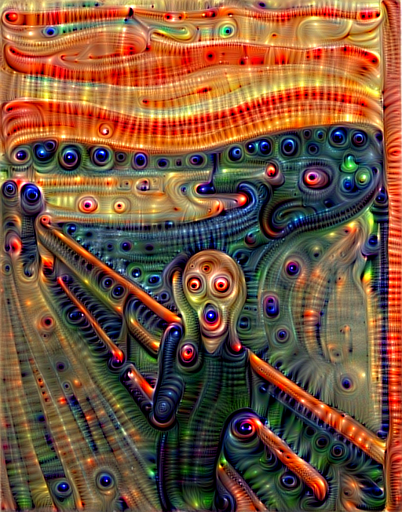
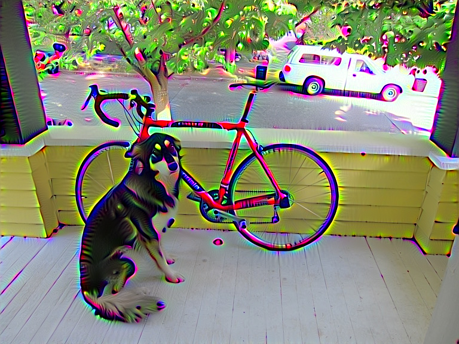
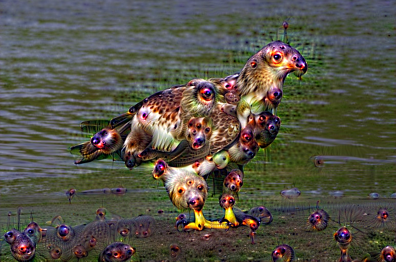
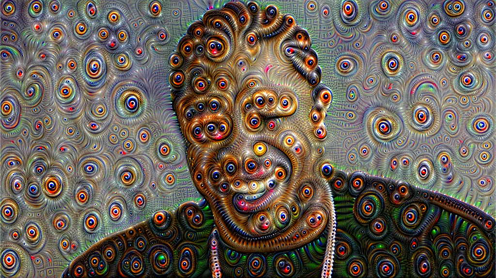
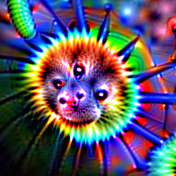
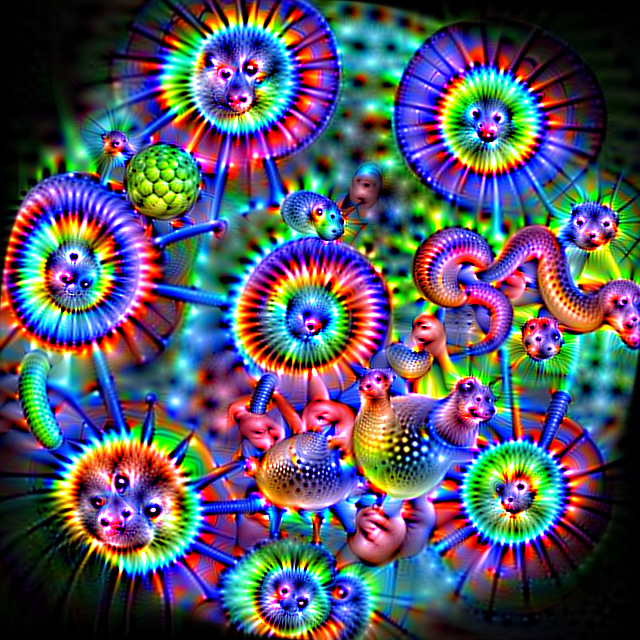

Once upon a time, in a University building almost, but not quite, entirely unlike the one you are sitting in right now, Simonyan, Vedaldi, and Zisserman had a [great idea](http://arxiv.org/pdf/1312.6034v2.pdf). They thought, hey we've been running these neural networks forward and they work pretty well, why not run them backward too? That way we can figure out what the computer is actually thinking about in there...

The resulting images were so horrific, so grotesque, that their screams could be heard all the way to Templeton.

[Many](http://arxiv.org/pdf/1412.0035v1.pdf) [researchers](http://arxiv.org/pdf/1412.1897v4.pdf) [have](http://arxiv.org/pdf/1506.02753.pdf) expanded on their work, including a well publicized [blog post](http://googleresearch.blogspot.com/2015/06/inceptionism-going-deeper-into-neural.html) by Google.

This is me copying those people who copied those other people who had a good idea.

## Have A Nightmare With Darknet ##

If you don't have Darknet installed, [do that first!](http://pjreddie.com/darknet/install/) To have our nightmare we will use a VGG-16 pretrained model. However, we don't need the whole model, just the convolutional layers, so we can use the `vgg-conv.cfg` file (which you should already have in the `cfg/` subdirectory). You will need to download the pretrained weights [here (57 MB)](http://data.pjreddie.com/files/vgg-conv.weights).

Now we can generate the scream image you saw in the first paragraph:

    ./darknet nightmare cfg/vgg-conv.cfg vgg-conv.weights data/scream.jpg 10

The command breaks down as follows: first we have the exectuable and subroutine, `./darknet nightmare`, followed by the config file and weights file, `cfg/vgg-conv.cfg vgg-conv.weights`. Finally we have the image we want to modify and the layer of the config file we want to target, `data/scream.jpg 10`.

This might take a while for you, especially if you are using CPU only. On my machine it takes about 15 minutes. I HIGHLY recommend [enabling CUDA](http://pjreddie.com/darknet/install/#cuda) to generate nightmares faster. With CUDA enabled it takes about 7 seconds on a Titan X.

You can experiment with lower layers to get a more artistic feel:

    ./darknet nightmare cfg/vgg-conv.cfg vgg-conv.weights data/dog.jpg 7

Or with higher layers to get more complex emergent behavior:

    ./darknet nightmare cfg/vgg-conv.cfg vgg-conv.weights data/eagle.jpg 13

## Special Options ##

You may notice that your generated scream dude doesn't look quite the same as mine. That's because I use some special options! The actual command I use is:

    ./darknet nightmare cfg/vgg-conv.cfg vgg-conv.weights \
    data/scream.jpg 10 -range 3 -iters 20 -rate .01 -rounds 4

Darknet generates the image in successive rounds, where the output of the previous round feeds into the next round. The image from each round is also written to disk. Each round is composed of some number of iterations. In each iteration, Darknet modifies the image to enhance the chosen layer at some scale. The scale is chosen randomly from a set of octaves. The layer is chosen randomly from a range of possible layers. The commands to modify this procedure are:

- `-rounds n`: change the number of rounds (default 1). More rounds means more images generated and usually more change to the original image.
- `-iters n`: change the number of iterations per round (default 10). More iterations means more change to the image per round.
- `-range n`: change the range of possible layers (default 1). If set to one, only the given layer is chosen at every iteration. Otherwise, a layer is chosen randomly within than range (e.g. 10 -range 3 will choose between layers 9-11).
- `-octaves n`: change the number of possible scales (default 4). At one octave, only the full size image is examined. Each additional octave adds a smaller version of the image (3/4 the size of the previous octave).
- `-rate x`: change the learning rate for the image (default .05). Higher means more change to the image per iteration but also some instability and imprecision.
- `-thresh x`: change the threshold for features to be magnified (default 1.0). Only features over `x` standard deviations away from the mean are magnified in the target layer. A higher threshold means fewer features are magnified.
- `-zoom x`: change the zoom applied to the image after each round (default 1.0). You can optionally add a zoom in (x < 1) or zoom out (x > 1) to be applied to the image after each round.
- `-rotate x`: change the rotation applied after each round (default 0.0). Optional rotation after each round.

There is a LOT here to play with! Here's an example with multiple rounds and a steady zoom-in:

<iframe width="560" height="315" src="https://www.youtube.com/embed/qlO4M6MfDFY" frameborder="0" allowfullscreen></iframe>

## A Smaller Model ##

VGG-16 is a very large model, if you are running out of memory, try using this model instead!

The cfg file is in the `cfg/` subdirectory (or [here](https://github.com/pjreddie/darknet/blob/master/cfg/jnet-conv.cfg)), you can download the weights [here (72 MB)](http://data.pjreddie.com/files/jnet-conv.weights).

    ./darknet nightmare cfg/jnet-conv.cfg jnet-conv.weights \
    data/yo.jpg 11 -rounds 4 -range 3

## Comparison With Deep Dream and GoogleNet ##

These examples use the VGG-16 network. While GoogleNet seems to fixate on [dogs and slugs](http://i.imgur.com/ebk1Cdc.jpg), VGG likes to produces badgermoles, a weird cross between a rodent and a monkey:

VGG also does not have the local response normalization layers that GoogleNet has. As a result, its nightmares are often hyper-saturated with starbursts of color.

Enjoy!

<iframe width="560" height="315" src="https://www.youtube.com/embed/Qjh6tg4n_ug" frameborder="0" allowfullscreen></iframe>
