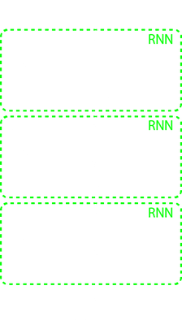
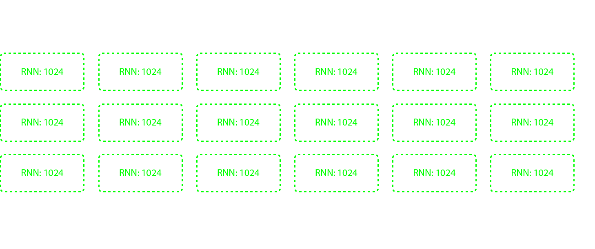
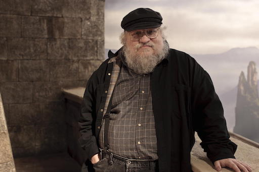
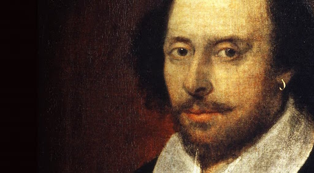
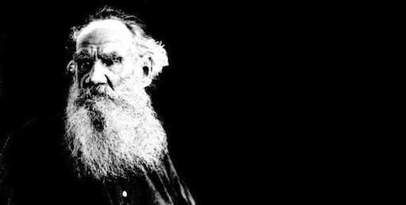
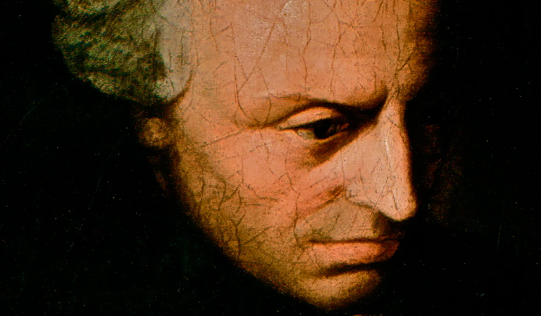

Recurrent neural networks are powerful models for representing data that changes over time. For a great introduction to RNNs I highly recommend Andrej Karpathy's [blog post from last year](http://karpathy.github.io/2015/05/21/rnn-effectiveness/) which was a great resource while implementing them!

All of these models use the same network architecture, a vanilla RNN with 3 recurrent modules.

Each module consists of 3 fully-connected layers. The input layer propagates information from the input to the current state. The recurrent layer propagates information through time from the previous state to the current one. Since we want both the input layer and the recurrent layer to affect the current state, we sum their outputs to get the current state. Finally, the output layer maps the current state to the output of that RNN module.

The input to the network is a [1-hot encoding](https://en.wikipedia.org/wiki/One-hot) of ASCII characters. We train the network to predict the next character in a stream of characters. The output is constrained to be a probability distribution using a softmax layer.

Since each recurrent layer contains information about the current character and the past characters, it can use this context to predict the future characters in a word or phrase. Unfolded through time the training looks like this:

Despite only predicting one character at a time, these networks can be very powerful. At test time, we can evaluate the likelihood of a given sentence, or we can make the network generate text on it's own!

To generate text, first we seed the network by inputting some character like a newline `'\n'`, or set of characters like a sentence. Then we take the output of the network on the last character and feed it back into the network as input. Since the output of the network is a probability distribution for the next character we can either take the most likely character or sample from the given distribution, but sampling tends to produce more interesting results.

## Generating Text with Darknet ##

First you should [install](https://pjreddie.com/darknet/install/) Darknet. Since you won't need CUDA or OpenCV, this is as simple as cloning the [GitHub repository](https://github.com/pjreddie/darknet):

    git clone https://github.com/pjreddie/darknet
    cd darknet
    make

Once you pick out what weight file you want to use, you can generate text with the following command:

    ./darknet rnn generate cfg/rnn.cfg <weights>

You can also pass a variety of flags to this command:

- `-len <int>`: change the length of text generated, default 1,000
- `-seed <string>`: seed the RNN with the given string, default `"\n"`
- `-srand <int>`: seed the random number generator, for repeatable runs
- `-temp <float>`: set the temperature for sampling, default 0.7

Enough chit-chat, let's impersonate some people!!

## George R.R. Martin ##

>JON
>
>
>He leaned close and onions, barefoot from his shoulder. "I am not a purple girl," he said as he stood over him. "The sight of you sell your father with you a little choice."
>
>"I say to swear up his sea or a boy of stone and heart, down," Lord Tywin said. "I love your word or her to me."
>
>"Lord Tywin would have worn them and see my commands." He took the cloth of dragons for his brother to take the crow to the other side of the gallery and the wailing helps her maidenhead of the only trunk of the dead men loved by the time they had come to rest. The red priest was pleased to be done with a smile to show them from the beginning lands and red and strong, and the stables she had been king on the water, and the child will be lost in the night before his father's son. Even his brothers made her way for him and the king to take the swift of the king. The first time will take me for our command," Ned said. "Before an inn, the Sons of the Lord of Light, we must be good beard."
>
>A day and she told herself. The girl was a brothel, and the first thing not to be any sons that you were so bolder, when you might have come to me. But the most pursuit he would not be betrayed my fool. I should be more than one, he will have the sellsword floor to her death, and my sons are weak and sail."
>
>"And the king has dead," Hizdahr said. "I was a speak of whom you are disappointed."
>
>"I know what you had promised, Your Grace. We ever seen the knights to spare the soldier pines. And so he die," said Ser Alliser.
>
>"The crows will give me when you give her a bit of gold to his head off."
>
>"Then I see me to send your captives, remain your head from the realm."

Some big spoilers here! For example, Jon is not a "purple girl", so I guess that's good?

To generate this text you have to download this weight file: [grrm.weights (36 MB)](https://data.pjreddie.com/files/grrm.weights). Then run this command:

    ./darknet rnn generate cfg/rnn.cfg grrm.weights -srand 0 -seed JON

You can change `srand` or `seed` to generate different text, so go wild! I really hope I don't get sued for this...

The random number generator on OS X is different than in Linux so if you run the same command you get different output:

>JON
>
>Each in days and the woods followed his king. "I understand."
>
>"I am not your sister Lord Robert?"
>
>"The door was always some cellar to do his being girls and the Magnar of Baratheon, and there were thousands of every bite of half the same as though he was not a great knight should be seen, and not to look at the Redwyne two thousand men."
>
>"And Ser Kevan should have made a sword with the smallfolk after the lower help, so Lord Arryn was not like to do with me. And he never was being holding only one man did not seem as though the castle was making some ravens from broken and gold, and reached out to one knee. "The Hand of the Free Cities and women are being offered meekly on the Wall, and ended the course of his accusations," said Bran. "My cousin Lannister was the boy. There are worships for hours. A woman," Ser Jorah said drums.
>
>"Ser Jaime was a sure to be a wooden sword. She was the only one of my chain makes you, my lady."
>
>"There are you satisfied, my lord?"
>
>"You have my journey," he said. "We should have killed the Seven Kingdoms. Lord Nestor should not read her if you would have told her of the likes of you think that death as well, and men and had been far to the docks. She didn't know how to find some visit to the king. His sister had seen Asha was being done. "You were to say that you will not provoke you to the wall aoothes, the more reason to take the gold of all the men of your realm with the sense in the back of the sea."
>
>"This is your mother," he told them. "I don't know what I am not without your brother, but that was the Lord of Light has wanted to stand there."
>
>"And if I had a son of mine, my lord?"
>
>Ser Alliser had not been safe first, but the hall was more apt to see the next time. My lord father had risen to join their crowns, when the septons slid the children of dragons, of his swords, and the wildlings and his words were singing the steps. "If you did not let her truly steal or swords?"
>
>"As you wish," said Jojen.

## William Shakespeare ##

<pre>
    The King hath been bestow'd and do his daughter to
    Have a devil's tale that I will see it so.
    There's more in a man turn'd to us for my sister.
                           [Striking him]
                                                          Exeunt

SCENE II.
Wales. Enter QUEEN, and MISTRESS PAGE
  PISTOL. Do you behold his trunk?
  ALCIBIADES. As a man that I have show'd them
    To expect my cousin, and our revenge
    To show you to my suspect that blows
    And lov'd you to the earth to my deeds will seem,
    And with the sealing of the belly's life
    Hath more than any of it. They say, how then?
    His head is not his bed. Look your shadow
    That gives the hour of them thou be done better.
    Come, let us sleep.
  FIRST WITCH. Sirrah, he shall not be a man,
    In a maid he did confess the modesty
    And make some continual outward woman;
    For your unfirm thy crown. Let him be crack'd
    And fathers on the eastly as they had
    A dagger do a widow of the clock;
    There was not thought to set a penny hold on with her
    With the tyrant that never show'd my power.
    The death of faith, and whate'er came upon him.
    My good lord; but in the man may straight
    As if he sleep the air of England's son,
    Are mortality! Stand father, and o'erreaten
    And banish thee, convey them that thinK's whisper.
                                                               Exit
</pre>

Weight file: [shakespeare.weights](https://data.pjreddie.com/files/shakespeare.weights)

To generate this text run:

    ./darknet rnn generate cfg/rnn.cfg shakespeare.weights -srand 0

This example uses the default seed of a newline character (`"\n"`). Changing the text seed or the random number seed will change the generated text.

This model was trained on the complete works of Shakespeare in a single file: [shakespeare.txt](https://pjreddie.com/admin/core/file/31/), originally from [Project Gutenberg](http://www.gutenberg.org/ebooks/100).

## Leo Tolstoy ##

>Chapter 22
>
>The Minister of the household was dissatisfied with him that he had fond of him and say in the same way to his place and laying out at a class, and yet Kamagina began to tell himself, was suddenly a French panic-stricken in his heart. "And I am so much better, while you hear, it's all day!" shouted the princess.
>
>"And Korsunsky?"
>
>"But you have had no mention in order to find anything for her. I couldn't say that something was a certain order and that you know that friend senseless words, and when they have children seen it, and my position is the matter to look at his letter."
>
>"Yes, I must do so. You won't do it, but I can't make you the greatest numerous state of having been on the other, boy. He knew it how they got it at the point of view with which he saw that the candles remained silent, and he had always happened to the enemy of a complicated. The superiors of them where she was continually conscious of his only desire to start from the field of battle air, and a weak indignation on the sleigh.

Weight file: [tolstoy.weights](https://data.pjreddie.com/files/tolstoy.weights)

To generate this text run:

    ./darknet rnn generate cfg/rnn.cfg tolstoy.weights -srand 0 -seed Chapter

## Immanuel Kant ##

>Thus, the latter is cogitated in its empirical causality, it is here in the world of sense- an imperative and therefore of homogeneity is in concreto, must by that I have called moral phinosssay or unless we are able to say that it is not contradictorily haveally distinguished from desires to take the state without this faculty the following good, which is the foundation of the categories, and so act in accordance with the laws of nature (despite them and the truth of all minor in the series. This composite is nothing more than the principles of the pure understanding, even in the case of the idea of a transcendental idea. And thus the preposition cannot be inculpable.
>
>Hence it follows that the representation of a supersensible necessity in concreto, as dependent on something merely as a mere form of phenomena, that is, of a supersensible system of nature by which what we have now properly contrary to the concept of freedom, for example, the second the notion of it alone is an absolutely necessary, but that it is a body passed sound simply under the head of the hypothesis.
>
>But the relation of the possibility of all objects of experience, and consequently not according to the laws of nature, which he had not been said, it is only the possibility of the object thereof, as the form in the mere estimate of a supreme way in which they are thought by means of any intuition of the moral law, reason is represented as a duty, that therefore no object to empirical reason has been understood about the influence on the judgement of reason, and as such they are extended of the subject in the synthesis of imagination, and which is independent of that which happens).

Weight file: [kant.weights](https://data.pjreddie.com/files/kant.weights)

To generate the above text, run:

    ./darknet rnn generate cfg/rnn.cfg kant.weights -srand 0 -seed Thus -temp .8

## Slack ##

<pre>
ztatlock: oh god
ztatlock: <@doug> having a new repository
jrw: good name is fast
jtoman: @Doug yeah, it's always a holiday perfect
jtoman: it was super fun to watch this stuff, may not big up super
    useful features.
talia: i mean the one we are pretty cool but i didn't think of
    anything that doesn't seem to be in the accent -n
ashe2: <@djg> as both the most objects into facebook, and love
    the same thing and really care, when do a lot of PLSE?
bholt: @JohnToman if you merge in HNT?
talia: I mean Reading group then
doug: the lesson has left is badly?
pavpanchekha: @ashe2 no bigger though
pjreddie: I see
jrw: also soundness is a natural number
ericreed: they still want to do it (not support for syntax
    highlighting is pretty good
jroesch: I found a bunch of people sitting right?
pjreddie: it would be good to get an actual undergrad reading group
    today...
doug: <@ashe2> yeah, that's what we need a (jimmyjohns)
ztatlock: @ztatlock uploaded a file:
    https://uw-cse.slack.com/files/pjreddie/F0K073WE0/screen_shot_2015-06-06_at_9_09_43_jpg
doug: the revolution will will crave to sign up for a paper theory
    papers than you have to actually work with the problem of the
    crazy theory after this with uwplse: do someone is here to avoid
    having people could be a but if they didn't understand.
pavpanchekha: That's a good idea
darzu: Maybe the best emoticon
</pre>

I'm not going to post this model but you can download your own Slack logs and train a model on them! How, you ask? Read on....

## Train Your Own Model ##

You can also train your own model on new text data! The training configuration file is `cfg/rnn.train.cfg`. All you need for training is a text file with all of your data in ASCII. Then you run the following command:

    ./darknet rnn train cfg/rnn.train.cfg -file data.txt

The model will save periodic backups to the directory specified in `src/rnn.c` in the function `train_char_rnn`, you probably want to change this directory to a good location for your machine. To restart training from a backup you can run:

    ./darknet rnn train cfg/rnn.train.cfg backup/rnn.train.backup -file data.txt

If you want to train the large model on a lot of data you will probably need to run it on a fast GPU. You can train it on CPU but it may take a while, you have been warned!
